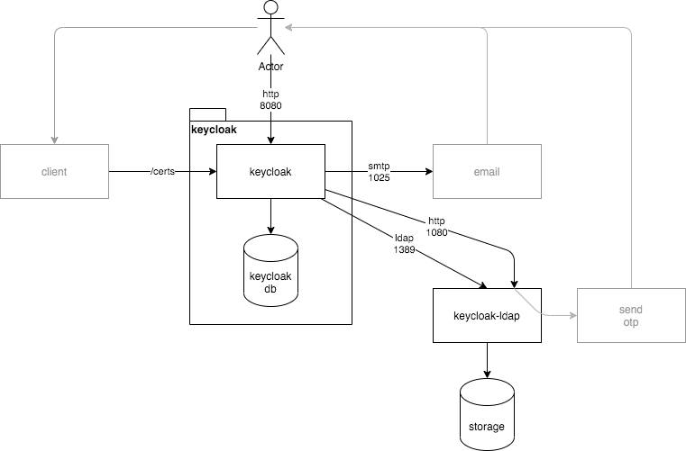

# @spurreiter/keycloak-ldap

A ldap stub adapter for keycloak

Connect your user store via ldap to keycloak.
Avoids the need to write SPI adapters to connect your users.



## customization

Write your own storage-adapter to your user accounts and connect those via ldap to keycloak.

Check `src/adapter/interface.js` and `src/adapter/mock.js`. 

The required setup for the keycloak realm(s) can be found in `scripts/my-realm.json`.

See `src/dev.js` for usage in your own project

## example

Start the example. 

```sh
node scripts/docker-build.js
node scripts/docker-run.js
# wait a minute for the container to start
node scripts/import-realm.js
npm run dev
```

## multi-factor-authentication 

`src/mfa` contains a express router to handle generation and sending of OTP codes. 

The sendMfa function as well as the temporary storage adapter for the generated OTP codes needs to be implemented. 

```js
const app = express()
const {
  mfaRouter,
} = require('@spurreiter/keycloak-ldap')
// create your own storage adapter - see `src/adapter/mock.js`
const adapter = new Adapter()
// your function to send the OTP code
const sendMfa = ({ destination, code, ...userattributes } ) => 
  console.log({destination, code})
// mount the router
app.use('/mfa', mfaRouter({ adapter, sendMfa }))
// start the server
http.createServer(app).listen(1080, 'localhost')
```


